# 階層的意見分析パイプライン (Hierarchical Opinion Analysis Pipeline)

[](https://python.org/downloads)
[](https://github.com/psf/black)

## 📝 プロジェクト概要

このプロジェクトは、大量のテキストデータ（特にアンケートやパブリックコメントなどの意見データ）を入力として受け取り、意味的に類似する意見を階層的にクラスタリングし、大規模言語モデル（LLM）を活用して各クラスターの要約やラベル付け、全体概要の生成を行う分析パイプラインです。

主な機能は以下の通りです。

*   テキストからの意見抽出
*   意見のベクトル化（Embedding）
*   階層的クラスタリング（UMAP + KMeans + 階層的マージ）
*   LLMによるクラスターの自動ラベリング（初期・マージ）
*   LLMによる全体概要の生成
*   分析結果のJSON/CSV/テキスト形式での出力

## 📚 技術スタック

*   **言語:** Python 3.11+
*   **パッケージ管理:** [uv](https://github.com/astral-sh/uv)
*   **主要ライブラリ:**
    *   [Pandas](https://pandas.pydata.org/): データ操作・分析
    *   [NumPy](https://numpy.org/): 数値計算
    *   [SciPy](https://scipy.org/): 科学技術計算（特に階層的クラスタリング）
    *   [scikit-learn](https://scikit-learn.org/): 機械学習（KMeans）
    *   [UMAP-learn](https://umap-learn.readthedocs.io/): 次元削減
    *   [OpenAI Python Library](https://github.com/openai/openai-python): OpenAI/Azure OpenAI API連携
    *   [Google GenAI Python SDK](https://github.com/google/generative-ai-python): Google Gemini API連携
    *   [python-dotenv](https://github.com/theskumar/python-dotenv): 環境変数管理
    *   [Pydantic](https://docs.pydantic.dev/): データバリデーション
    *   [Joblib](https://joblib.readthedocs.io/): 並列処理
    *   [tqdm](https://github.com/tqdm/tqdm): プログレスバー表示
*   **LLM:** Azure OpenAI または Google Gemini (設定により切り替え可能)
*   **レポート:** Streamlit (reporting/streamlit_report.py)

## 📂 フォルダ構成

```
├── .cline/              # Cline ルール定義 (リポジトリ品質チェック用)
├── configs/             # パイプライン実行設定ファイル (JSON)
│   ├── hierarchical-example-polis.json # 設定例
│   └── sample.json        # 設定テンプレート
├── inputs/              # 入力データ (CSV)
│   └── example-polis.csv  # 入力データ例
├── outputs/             # パイプライン実行結果出力先
│   └── hierarchical-example-polis/ # 例: 設定ファイル名に基づくディレクトリ
│       ├── args.csv                 # 抽出された意見 (+カテゴリ分類結果)
│       ├── relations.csv            # 元コメントと抽出意見の関係
│       ├── embeddings.pkl           # 意見の埋め込みベクトル
│       ├── hierarchical_clusters.csv # 階層クラスタリング結果 (ID, 座標, 各階層ID)
│       ├── hierarchical_initial_labels.csv # 初期ラベリング結果 (ボトムアップ)
│       ├── hierarchical_merge_labels.csv  # マージラベリング結果 (ID, ラベル, 説明, 親, 密度など)
│       ├── hierarchical_overview.txt    # LLMによる全体概要
│       ├── hierarchical_result.json     # 最終的な集約結果 (レポート用: arguments, clusters, propertyMapなど)
│       ├── hierarchical_status.json     # パイプライン実行ステータス
│       └── final_result_with_comments.csv # (is_pubcom=true時)元コメント+意見+カテゴリ付き結果
├── prompts/             # LLM プロンプトテンプレート
│   ├── extraction/
│   ├── hierarchical_initial_labelling/
│   ├── hierarchical_merge_labelling/
│   ├── hierarchical_overview/
│   ├── labelling/ (現在 hierarchical_main では未使用)
│   ├── overview/ (現在 hierarchical_main では未使用)
│   ├── takeaways/ (現在 hierarchical_main では未使用)
│   └── translation/ (現在 hierarchical_main では未使用)
├── reporting/           # レポート生成関連 (Streamlit)
│   └── streamlit_report.py
├── services/            # 外部サービス連携・共通処理
│   ├── category_classification.py # LLMによるカテゴリ分類
│   ├── llm.py             # LLM API (Azure/Gemini) 連携
│   └── parse_json_list.py # LLM応答からのJSONリスト抽出
├── steps/               # パイプラインの各処理ステップ
│   ├── embedding.py
│   ├── extraction.py
│   ├── hierarchical_aggregation.py
│   ├── hierarchical_clustering.py
│   ├── hierarchical_initial_labelling.py
│   ├── hierarchical_merge_labelling.py
│   └── hierarchical_overview.py
├── .env.example         # 環境変数設定例
├── .gitignore           # Git追跡除外ファイル定義
├── hierarchical_main.py   # パイプライン実行メインスクリプト
├── hierarchical_specs.json # パイプラインステップ定義・デフォルト設定
├── hierarchical_utils.py  # 設定読み込み・パイプライン制御ユーティリティ
├── pyproject.toml       # プロジェクト定義・依存関係 (PEP 621)
├── README.md            # このファイル
└── uv.lock              # 依存関係ロックファイル (uv用)

```

## 🔄 ファイル連携図 (Mermaid)

```mermaid
graph TD
    subgraph Configs
        direction LR
        UserConfig[configs/*.json]
        Specs[hierarchical_specs.json]
        Prompts[prompts/*/*.txt]
        Env[.env / .env.example]
    end

    subgraph Inputs
        InputCSV[inputs/*.csv]
    end

    subgraph Pipeline Execution
        direction TB
        Main[hierarchical_main.py] -- Reads Config --> UserConfig
        Main -- Reads Specs --> Specs
        Main -- Calls --> Utils
        Utils[hierarchical_utils.py] -- Reads Config/Specs/Prompts --> Configs
        Utils -- Manages Steps --> Steps
        Utils -- Writes --> StatusJSON[outputs/*/hierarchical_status.json]

        subgraph Steps
            direction TB
            S_Extract[steps/extraction.py] -- Reads --> InputCSV
            S_Extract -- Uses --> SVC_LLM[services/llm.py]
            S_Extract -- Uses --> SVC_CatClass[services/category_classification.py]
            S_Extract -- Uses --> SVC_ParseJSON[services/parse_json_list.py]
            S_Extract -- Writes --> ArgsCSV[outputs/*/args.csv]
            S_Extract -- Writes --> RelationsCSV[outputs/*/relations.csv]

            S_Embed[steps/embedding.py] -- Reads --> ArgsCSV
            S_Embed -- Uses --> SVC_LLM
            S_Embed -- Writes --> EmbeddingsPKL[outputs/*/embeddings.pkl]

            S_Cluster[steps/hierarchical_clustering.py] -- Reads --> ArgsCSV
            S_Cluster -- Reads --> EmbeddingsPKL
            S_Cluster -- Writes --> HClustersCSV[outputs/*/hierarchical_clusters.csv]

            S_InitialLabel[steps/hierarchical_initial_labelling.py] -- Reads --> HClustersCSV
            S_InitialLabel -- Uses --> SVC_LLM
            S_InitialLabel -- Writes --> HInitialLabelsCSV[outputs/*/hierarchical_initial_labels.csv]

            S_MergeLabel[steps/hierarchical_merge_labelling.py] -- Reads --> HInitialLabelsCSV
            S_MergeLabel -- Uses --> SVC_LLM
            S_MergeLabel -- Writes --> HMergeLabelsCSV[outputs/*/hierarchical_merge_labels.csv]

            S_Overview[steps/hierarchical_overview.py] -- Reads --> HMergeLabelsCSV
            S_Overview -- Uses --> SVC_LLM
            S_Overview -- Writes --> OverviewTXT[outputs/*/hierarchical_overview.txt]

            S_Aggregate[steps/hierarchical_aggregation.py] -- Reads --> ArgsCSV
            S_Aggregate -- Reads --> RelationsCSV
            S_Aggregate -- Reads --> HClustersCSV
            S_Aggregate -- Reads --> HMergeLabelsCSV
            S_Aggregate -- Reads --> OverviewTXT
            S_Aggregate -- Reads --> InputCSV
            S_Aggregate -- Reads --> UserConfig
            S_Aggregate -- Writes --> ResultJSON[outputs/*/hierarchical_result.json]
            S_Aggregate -- Writes --> FinalCSV[outputs/*/final_result_with_comments.csv]

            SVC_CatClass -- Uses --> SVC_LLM
        end
    end

    subgraph Services
        direction LR
        SVC_LLM -- Uses --> Env
        SVC_ParseJSON
    end

    subgraph Outputs
        direction TB
        ArgsCSV
        RelationsCSV
        EmbeddingsPKL
        HClustersCSV
        HInitialLabelsCSV
        HMergeLabelsCSV
        OverviewTXT
        ResultJSON
        StatusJSON
        FinalCSV
    end

    subgraph Reporting
        ReportApp[reporting/streamlit_report.py] -- Reads --> ResultJSON
    end

    Main -- Runs --> S_Extract
    Main -- Runs --> S_Embed
    Main -- Runs --> S_Cluster
    Main -- Runs --> S_InitialLabel
    Main -- Runs --> S_MergeLabel
    Main -- Runs --> S_Overview
    Main -- Runs --> S_Aggregate

    UserConfig --> Utils
    Specs --> Utils
    Prompts --> Utils
    Env --> SVC_LLM
```



## 🐍 Pythonファイル役割説明

| ファイル名                              | 役割                                                                                                 |
| :-------------------------------------- | :--------------------------------------------------------------------------------------------------- |
| `hierarchical_main.py`                  | パイプライン全体の実行制御、コマンドライン引数の処理                                                  |
| `hierarchical_utils.py`                 | 設定ファイルの読み込み・検証、パイプラインステップの実行管理、実行ステータスの更新など共通ユーティリティを提供 |
| `hierarchical_specs.json`               | パイプラインの各ステップ定義、依存関係、デフォルトオプションを記述                                      |
| `services/llm.py`                       | LLM API（Azure OpenAI, Google Gemini）との通信処理を抽象化                                           |
| `services/category_classification.py` | LLMを使用して、抽出された意見を指定されたカテゴリに分類する処理                                        |
| `services/parse_json_list.py`         | LLMからの応答文字列（JSONリスト形式を期待）をパースするユーティリティ                                    |
| `steps/extraction.py`                   | 入力CSVから意見を抽出し、必要に応じてLLMによるカテゴリ分類を行う                                         |
| `steps/embedding.py`                    | 抽出された意見をベクトル化（Embedding）する                                                            |
| `steps/hierarchical_clustering.py`      | 意見ベクトルをUMAPで次元削減し、KMeansと階層的クラスタリングを組み合わせて階層構造を作成               |
| `steps/hierarchical_initial_labelling.py`| 最下層のクラスタに対して、LLMを用いて初期ラベルと説明を生成する                                        |
| `steps/hierarchical_merge_labelling.py` | 下位クラスタのラベル・説明を基に、上位クラスタのラベル・説明をLLMを用いて生成（マージ）し、密度も計算する |
| `steps/hierarchical_overview.py`        | 最上位に近い階層のクラスタ情報から、LLMを用いて全体の概要テキストを生成する                              |
| `steps/hierarchical_aggregation.py`     | 各ステップの出力結果を集約し、最終的なレポート用JSONファイルや元コメント付きCSVファイルを作成する       |
| `reporting/streamlit_report.py`       | 集約結果（JSON）を読み込み、Streamlitでインタラクティブなレポートを表示する（※詳細未確認）              |

## ⚙️ インストール

このプロジェクトでは、パッケージ管理に `uv` を使用することを推奨します。

1.  **リポジトリのクローン:**
    ```bash
    git clone https://github.com/parfait0707/test-broadlistening.git
    cd test-broadlistening
    ```

2.  **uv のインストール (未導入の場合):**
    ```bash
    # macOS / Linux
    curl -LsSf https://astral.sh/uv/install.sh | sh

    # Windows
    powershell -c "irm https://astral.sh/uv/install.ps1 | iex"
    ```
    詳細は [uv 公式ドキュメント](https://github.com/astral-sh/uv#installation) を参照してください。

3.  **仮想環境の作成と有効化:**
    ```bash
    uv venv
    source .venv/bin/activate  # macOS / Linux
    # .venv\Scripts\activate  # Windows (Command Prompt)
    # .venv\Scripts\Activate.ps1 # Windows (PowerShell)
    ```

4.  **依存関係のインストール:**
    ```bash
    uv pip install -r requirements.txt # pyproject.toml に基づく requirements.txt があれば
    # または直接 pyproject.toml からインストール (推奨)
    uv pip install .
    ```

5.  **環境変数の設定:**
    *   `.env.example` をコピーして `.env` ファイルを作成します。
    *   `.env` ファイルを開き、使用するLLM（Azure OpenAI または Gemini）のAPIキーやエンドポイントなどの情報を設定します。
    *   `USE_AZURE` を `true` (Azure OpenAI使用) または `false` (Gemini使用) に設定します。

    ```bash
    cp .env.example .env
    # nano .env や vim .env などで編集
    ```

## ▶️ 実行手順

パイプラインは `hierarchical_main.py` スクリプトを実行して起動します。実行には設定ファイルが必要です。

1.  **設定ファイルの準備:**
    *   `configs/` ディレクトリにある `sample.json` をコピーして、独自の設定ファイル（例: `configs/my_analysis.json`）を作成します。
    *   作成した設定ファイルを編集し、分析対象の入力ファイル名 (`input`)、問い (`question`)、使用するLLMモデル (`model`)、各ステップのオプションなどを指定します。詳細は後述の「設定ファイルの説明」を参照してください。

2.  **パイプラインの実行:**
    ```bash
    python hierarchical_main.py configs/your_config.json
    ```
    `configs/your_config.json` は、準備した設定ファイルのパスに置き換えてください。

3.  **実行オプション:**
    *   `-f` または `--force`: 以前の実行結果を無視し、全てのステップを強制的に再実行します。
    *   `-o STEP_NAME` または `--only STEP_NAME`: 指定したステップ (`extraction`, `embedding` など) のみを実行します。依存関係は考慮されません。
    *   `--skip-interaction`: 実行計画の確認プロンプトをスキップし、即座にパイプラインを実行します。

4.  **出力:**
    *   実行結果は `outputs/your_config_name/` ディレクトリ（設定ファイル名に基づく）に出力されます。
    *   主要な出力ファイルは「フォルダ構成」セクションを参照してください。

## 🔧 設定ファイルの説明

パイプラインの挙動は主に2つのファイルで制御されます。

1.  **実行設定ファイル (`configs/*.json`)**: 個別の分析実行ごとにカスタマイズする設定。
2.  **ステップ定義ファイル (`hierarchical_specs.json`)**: パイプラインの構造とデフォルトのステップ設定を定義。

### 1. 実行設定ファイル (`configs/*.json`) キー概要

ユーザーが `configs/` ディレクトリに作成するJSONファイルで設定可能な主なキーの概要です。各キーの詳細については、後続の「主要な設定キーの詳細」セクションを参照してください。

| キー (Key)                            | 影響を受けるファイル (Affected File(s))                         | 影響を受ける処理/関数 (Affected Process/Function)                                                                                                                                                              | 簡単な説明                                                                                                                                                                                                                                |
| :------------------------------------ | :-------------------------------------------------------------- | :--------------------------------------------------------------------------------------------------------------------------------------------------------------------------------------------------------- | :------------------------------------------------------------------------------------------------------------------------------------------------------------------------------------------------------------------------------------------------ |
| **トップレベル**                      |                                                                 |                                                                                                                                                                                                            |                                                                                                                                                                                                                                                   |
| `name`                                | `hierarchical_utils.py`, `hierarchical_aggregation.py`          | `update_status`, `hierarchical_aggregation`                                                                                                                                                                  | 実行/レポートの名前。出力ディレクトリ名にも使用される。                                                                                                                                                                            |
| `question`                            | `hierarchical_utils.py`, `hierarchical_aggregation.py`          | `validate_config`, `update_status`, `hierarchical_aggregation`                                                                                                                                             | 処理対象の問い。必須。                                                                                                                                                                                                       |
| `input`                               | `hierarchical_utils.py`, `steps/extraction.py`, `steps/hierarchical_aggregation.py` | `validate_config`, `initialization`, `extraction`, `add_original_comments`, `create_custom_intro`                                                                                              | 入力CSVファイル名（拡張子なし）。必須。                                                                                                                                                                  |
| `model`                               | `hierarchical_utils.py`, `steps/*`, `services/*`                | `initialization`, 各LLM利用ステップ (デフォルトモデルとして), `classify_batch_args`                                                                                                                                                    | デフォルトで使用するLLMモデル名。                                                                                                                                                            |
| `intro`                               | `hierarchical_utils.py`, `steps/hierarchical_aggregation.py`    | `validate_config`, `create_custom_intro`, `hierarchical_aggregation`                                                                                                                                       | レポートの導入文。                                                                                                                                                                           |
| `is_pubcom`                           | `steps/hierarchical_aggregation.py`, `hierarchical_utils.py`    | `hierarchical_aggregation`, `initialization` (デフォルト値設定)                                                                                                                                                | 元コメント付きCSV (`final_result_with_comments.csv`) を出力するかどうか。                               |
| **`extraction` ステップ**             |                                                                 |                                                                                                                                                                                                            |                                                                                                                                                                                                                                                   |
| `extraction.workers`                  | `steps/extraction.py`, `services/category_classification.py`    | `extraction`, `extract_batch`, `classify_args`                                                                                                                                                               | 意見抽出・カテゴリ分類処理の並列ワーカー数。                                                                                                                                                            |
| `extraction.limit`                    | `steps/extraction.py`, `steps/hierarchical_aggregation.py`    | `extraction`, `create_custom_intro`                                                                                                                                                                          | 処理する入力コメント数の上限。                                                                                                                                                                       |
| `extraction.properties`               | `steps/extraction.py`, `steps/hierarchical_aggregation.py`    | `_validate_property_columns`, `extraction`, `_build_property_map`                                                                                                                                            | 入力CSVから追加で読み込むカラム名のリスト。最終JSONの `propertyMap` に含まれる。                                                                                                                            |
| `extraction.categories`               | `steps/extraction.py`, `services/category_classification.py`, `steps/hierarchical_aggregation.py` | `extraction` (-> `classify_args`), `classify_args`, `_build_categories_string`, `_build_property_map`                                                                             | LLMによる追加カテゴリ分類の定義。最終JSONの `propertyMap` に含まれる。                                                                                                    |
| `extraction.category_batch_size`      | `services/category_classification.py`                           | `classify_args`                                                                                                                                                                                              | カテゴリ分類を行う際のバッチサイズ。                                                                                                                                                                      |
| `extraction.prompt`                   | `hierarchical_utils.py`, `steps/extraction.py`                  | `initialization`, `extract_batch`, `extract_arguments`                                                                                                                                                         | 意見抽出用のLLMプロンプト文字列。                                                                                                          |
| `extraction.model`                    | `hierarchical_utils.py`, `steps/extraction.py`, `services/category_classification.py` | `initialization`, `extract_batch`, `extract_arguments`, `classify_batch_args`                                                                                                                    | 意見抽出・カテゴリ分類に使用するLLMモデル名。                                                                                                                                                  |
| `extraction.prompt_file`              | `hierarchical_utils.py`                                         | `initialization`                                                                                                                                                                                              | 意見抽出用のLLMプロンプトファイル名。                                                                                                  |
| **`embedding` ステップ**              |                                                                 |                                                                                                                                                                                                            |                                                                                                                                                                                                                                                   |
| `embedding.model`                     | `hierarchical_utils.py`, `steps/embedding.py`, `services/llm.py`| `initialization`, `embedding`, `request_to_embed`, `request_to_azure_embed`                                                                                                                                    | 意見のベクトル化に使用する埋め込みモデル名。                                                                                                     |
| **`hierarchical_clustering` ステップ** |                                                                 |                                                                                                                                                                                                            |                                                                                                                                                                                                                                                   |
| `hierarchical_clustering.cluster_nums` | `steps/hierarchical_clustering.py`                              | `hierarchical_clustering`, `hierarchical_clustering_embeddings`                                                                                                                                              | 生成する階層クラスターの数のリスト（昇順）。                                                                                                                            |
| **`hierarchical_initial_labelling` ステップ** |                                                                 |                                                                                                                                                                                                            |                                                                                                                                                                                                                                                   |
| `hierarchical_initial_labelling.sampling_num` | `steps/hierarchical_initial_labelling.py`                 | `hierarchical_initial_labelling`, `initial_labelling`, `process_initial_labelling`                                                                                                                             | 初期ラベリングのために各クラスターからサンプリングする意見の数。                                                                                                                                           |
| `hierarchical_initial_labelling.workers` | `steps/hierarchical_initial_labelling.py`                 | `hierarchical_initial_labelling`, `initial_labelling`                                                                                                                                                          | 初期ラベリング処理の並列ワーカー数。                                                                                                                                                                    |
| `hierarchical_initial_labelling.prompt` | `hierarchical_utils.py`, `steps/hierarchical_initial_labelling.py` | `initialization`, `process_initial_labelling`                                                                                                                                                                | 初期ラベリング用のLLMプロンプト文字列。                                                                                                                               |
| `hierarchical_initial_labelling.model` | `hierarchical_utils.py`, `steps/hierarchical_initial_labelling.py` | `initialization`, `process_initial_labelling`                                                                                                                                                                | 初期ラベリングに使用するLLMモデル名。                                                                                                                                                          |
| `hierarchical_initial_labelling.prompt_file` | `hierarchical_utils.py`                                     | `initialization`                                                                                                                                                                                              | 初期ラベリング用のLLMプロンプトファイル名。                                                                                                             |
| **`hierarchical_merge_labelling` ステップ** |                                                                 |                                                                                                                                                                                                            |                                                                                                                                                                                                                                                   |
| `hierarchical_merge_labelling.sampling_num` | `steps/hierarchical_merge_labelling.py`                   | `merge_labelling`, `process_merge_labelling`                                                                                                                                                                   | マージラベリングのために各クラスターからサンプリングする意見の数。                                                                                         |
| `hierarchical_merge_labelling.workers` | `steps/hierarchical_merge_labelling.py`                   | `merge_labelling`                                                                                                                                                                                              | マージラベリング処理の並列ワーカー数。                                                                                                                                                                  |
| `hierarchical_merge_labelling.prompt` | `hierarchical_utils.py`, `steps/hierarchical_merge_labelling.py` | `initialization`, `process_merge_labelling`                                                                                                                                                                  | マージラベリング用のLLMプロンプト文字列。                                                                                                                                |
| `hierarchical_merge_labelling.model` | `hierarchical_utils.py`, `steps/hierarchical_merge_labelling.py` | `initialization`, `process_merge_labelling`                                                                                                                                                                  | マージラベリングに使用するLLMモデル名。                                                                                                                                                          |
| `hierarchical_merge_labelling.prompt_file` | `hierarchical_utils.py`                                     | `initialization`                                                                                                                                                                                              | マージラベリング用のLLMプロンプトファイル名。                                                                                                             |
| **`hierarchical_overview` ステップ**    |                                                                 |                                                                                                                                                                                                            |                                                                                                                                                                                                                                                   |
| `hierarchical_overview.prompt`        | `hierarchical_utils.py`, `steps/hierarchical_overview.py`       | `initialization`, `hierarchical_overview`                                                                                                                                                                    | 全体概要生成用のLLMプロンプト文字列。                                                                                                                                        |
| `hierarchical_overview.model`         | `hierarchical_utils.py`, `steps/hierarchical_overview.py`       | `initialization`, `hierarchical_overview`                                                                                                                                                                    | 全体概要生成に使用するLLMモデル名。                                                                                                                                                          |
| `hierarchical_overview.prompt_file`   | `hierarchical_utils.py`                                         | `initialization`                                                                                                                                                                                              | 全体概要生成用のLLMプロンプトファイル名。                                                                                                                    |
| **`hierarchical_aggregation` ステップ** |                                                                 |                                                                                                                                                                                                            |                                                                                                                                                                                                                                                   |
| `hierarchical_aggregation.sampling_num` | `steps/hierarchical_aggregation.py`                             | (現状、コード内で直接的な影響はない)                                                                                                                                  | (説明保留)                                                                                                                                                                                                                                 |
| `hierarchical_aggregation.hidden_properties` | `steps/hierarchical_aggregation.py`                       | `_build_property_map`                                                                                                                                                                                         | 最終JSONの `propertyMap` に含めるが、特別な意味合いを持つ属性を指定。                                                  |

---

### 主要な設定キーの詳細

以下に、主要な設定キーについて、その役割、設定例、影響を詳細に説明します。

#### `input` (トップレベル, 必須)

*   **役割**: 分析対象となる入力データファイル名を指定します。このファイルは `inputs/` ディレクトリに配置されている必要があります。
*   **設定例**:
    ```json
    "input": "example-polis"
    ```
    これは `inputs/example-polis.csv` を読み込むことを意味します。拡張子 `.csv` は含めません。
*   **影響**:
    *   `steps/extraction.py`: このファイルから元のコメント (`comment-body` カラム) と、`extraction.properties` で指定された追加カラムを読み込みます。
    *   `steps/hierarchical_aggregation.py`: `is_pubcom=true` の場合、最終的な元コメント付きCSV (`final_result_with_comments.csv`) を生成する際に、このファイルから元コメントやその他のカラム（`source`, `url` などが存在すれば）を読み込みます。また、レポート導入文 (`config.intro`) を生成する際に、入力コメントの総数を取得するためにも使用されます。
    *   **設定しない場合**: パイプラインはエラーとなり実行できません (`hierarchical_utils.py` の `validate_config` でチェックされます)。

#### `question` (トップレベル, 必須)

*   **役割**: この分析が対象としている中心的な「問い」を文字列で指定します。最終的なレポート (`hierarchical_result.json`) に含まれ、分析の文脈を示すために使用されます。
*   **設定例**:
    ```json
    "question": "人類が人工知能を開発・展開する上で、最優先すべき課題は何でしょうか？"
    ```
*   **影響**:
    *   `steps/hierarchical_aggregation.py`: 最終出力 `hierarchical_result.json` の `config.question` フィールドにこの値が格納されます。
    *   **設定しない場合**: パイプラインはエラーとなり実行できません (`hierarchical_utils.py` の `validate_config` でチェックされます)。

#### `model` (トップレベル)

*   **役割**: パイプライン全体でデフォルトとして使用されるLLMのモデル名を指定します。各ステップ（`extraction`, `hierarchical_initial_labelling` など）で個別に `model` が指定されていない場合、このトップレベルの値が使用されます。
*   **設定例**:
    ```json
    "model": "gpt-4o"
    ```
    または
    ```json
    "model": "gemini-1.5-flash"
    ```
    (利用するLLMの種類は `.env` の `USE_AZURE` で切り替えます)
*   **影響**:
    *   `services/llm.py` を利用する全てのステップ (`extraction`, `hierarchical_initial_labelling`, `hierarchical_merge_labelling`, `hierarchical_overview`) および `services/category_classification.py` に影響します。
    *   各ステップで `model` キーが指定されていればそちらが優先されます。
    *   APIコスト、処理速度、出力品質（抽出精度、ラベル品質、概要品質など）に直接影響します。
    *   **設定しない場合**: `hierarchical_utils.py` の `initialization` 関数で、デフォルト値として "gpt-4o-mini" (元のリポジトリでは "gpt-3.5-turbo") が設定されます。

#### `extraction.limit`

*   **役割**: `extraction` ステップで処理する入力コメント数の上限を設定します。デバッグやテスト目的で処理対象を絞りたい場合に使用します。
*   **設定例**:
    ```json
    "extraction": {
      "limit": 200
    }
    ```
    入力CSVの先頭から最大200件のコメントのみを処理します。
*   **影響**:
    *   `steps/extraction.py`: 入力CSVから読み込む行数をこの値で制限します。
    *   `steps/hierarchical_aggregation.py`: レポート導入文 (`config.intro`) の生成時に、実際に処理された件数としてこの値（または実際の入力件数の少ない方）が参照されます。
    *   設定した上限数までしか意見抽出が行われないため、以降の全ステップ（Embedding, Clustering, Labelling, Overview, Aggregation）の対象データ量が制限されます。
    *   最終的なアウトプットに含まれる意見の数やクラスターの構成に影響します。
    *   **設定しない場合**: `hierarchical_specs.json` のデフォルト値（例: 1000）が適用されます。

#### `extraction.properties`

*   **役割**: 入力CSVファイルから `comment-id`, `comment-body` 以外に追加で読み込み、最終的なレポートデータ (`hierarchical_result.json`) に属性情報として含めたいカラム名のリストを指定します。例えば、回答者の属性（年齢、地域など）やコメントのソースなど。
*   **設定例**:
    ```json
    "extraction": {
      "properties": ["age", "source"]
    }
    ```
    入力CSVから `age` カラムと `source` カラムを読み込みます。
*   **影響**:
    *   `steps/extraction.py`: 指定されたカラムを入力CSVから読み込みます。存在しないカラム名を指定するとエラーになります (`_validate_property_columns` でチェック)。読み込んだデータは `args.csv` には直接保存されませんが、メモリ上で保持され `hierarchical_aggregation.py` で利用されます。
    *   `steps/hierarchical_aggregation.py`: `_build_property_map` 関数で処理され、最終出力 `hierarchical_result.json` の `propertyMap` キーに、指定されたプロパティ名（例: `age`, `source`）をキーとし、その値が `arg-id` ごとにマッピングされた辞書が格納されます。
    ```json
    "propertyMap": {
      "age": {
        "A1_0": 25, // A1_0 という意見は age が 25 のコメントから抽出された
        "A2_0": 30,
        // ...
      },
      "source": {
        "A1_0": "web form",
        "A2_0": "email",
        // ...
      }
      // categories で指定された属性もここに含まれる
    }
    ```
    *   `propertyMap` に含まれることで、レポートツールなどでこれらの属性に基づいた意見のフィルタリングや分析が可能になります。
    *   **設定しない場合**: `hierarchical_specs.json` のデフォルト値（通常は空リスト `[]`）が適用され、`comment-id` と `comment-body` 以外のカラムは読み込まれません。

#### `extraction.categories`

*   **役割**: 抽出された個々の意見 (`argument`) に対して、LLMを用いて追加のカテゴリ分類を行うための定義を指定します。カテゴリ名とその分類基準（LLMへの指示）を辞書形式で記述します。
*   **設定例**:
    ```json
    "extraction": {
      "categories": {
        "sentiment": { // カテゴリ名 (最終的なカラム名や propertyMap のキーになる)
          "positive": "肯定的な意見につけるカテゴリ", // 分類基準 (LLMへの指示)
          "negative": "否定的な意見につけるカテゴリ",
          "neutral": "中立的な意見につけるカテゴリ"
        },
        "priority": {
          "high": "緊急性が高い、または重要度が高いと判断される意見",
          "medium": "中程度の緊急性・重要度を持つ意見",
          "low": "緊急性・重要度が低い、または情報提供的な意見"
        }
      }
    }
    ```
*   **影響**:
    *   `steps/extraction.py`: この設定が存在する場合（空でない場合）、`services/category_classification.py` の `classify_args` 関数を呼び出します。
    *   `services/category_classification.py`: `classify_batch_args` 関数がLLM APIを呼び出し、設定された定義に基づいて各意見を分類します。APIコールが発生し、処理時間が増加します。
    *   **最終アウトプット**:
        *   `outputs/{config_name}/args.csv`: `sentiment` や `priority` といったカテゴリ名のカラムが追加され、LLMによる分類結果が格納されます。
        *   `outputs/{config_name}/hierarchical_result.json` (`propertyMap` キー): `properties` と同様に、`sentiment` や `priority` がキーとなり、各 `arg-id` に対応する分類結果が値として格納されます。レポートツールでのフィルタリング等に利用できます。
        *   `outputs/{config_name}/final_result_with_comments.csv` (`is_pubcom=true` 時): このファイルにもカテゴリ分類のカラムが追加されます。
    *   **設定しない場合 (空 `{}` または未指定)**: カテゴリ分類処理は完全にスキップされます。LLM APIコールは発生せず、`args.csv` や `propertyMap` にカテゴリ情報は追加されません。

#### `embedding.model`

*   **役割**: 意見テキストをベクトル表現（Embedding）に変換するために使用するモデルを指定します。テキストの意味を捉える精度やベクトル空間の特性に影響し、後続のクラスタリング結果に大きく影響します。
*   **設定例**:
    ```json
    "embedding": {
      "model": "text-embedding-3-large"
    }
    ```
    (利用可能なモデルは `services/llm.py` の `EMBEDDING_MODELS` やAzure/Geminiのドキュメントを確認してください)
*   **影響**:
    *   `steps/embedding.py`: `request_to_embed` 関数（内部で `services/llm.py` の `request_to_azure_embed` または Gemini の Embedding 関数を呼び出す）にこのモデル名が渡されます。
    *   生成されるベクトル (`outputs/{config_name}/embeddings.pkl`) の質と次元数が変わります。
    *   ベクトルが変わるため、`steps/hierarchical_clustering.py` での UMAP による次元削減結果 (`x`, `y` 座標）や、KMeans/階層的クラスタリングの結果（どの意見がどのクラスターに属するか）が**大きく変化します**。
    *   結果として、ラベリング、概要、最終的なレポート (`hierarchical_result.json` の `arguments` や `clusters`) の内容全体に影響が及びます。
    *   モデルによってはAPIコストも変動します。
    *   **設定しない場合**: `hierarchical_specs.json` のデフォルト値（例: `text-embedding-3-small`）が使用されます。

#### `hierarchical_clustering.cluster_nums`

*   **役割**: 階層的クラスタリングにおいて、生成するクラスター数のレベルを指定するリストです。リストの要素は昇順で指定する必要があります。例えば `[3, 6, 12]` と指定すると、3個、6個、12個のクラスターに分割する3つの階層が生成されます。
*   **設定例**:
    ```json
    "hierarchical_clustering": {
      "cluster_nums": [3, 6, 12, 24]
    }
    ```
*   **影響**:
    *   `steps/hierarchical_clustering.py`:
        *   リストの最大値（例: 24）が初期のKMeansクラスタリングの `n_clusters` として使用されます。
        *   その後、`merge_clusters_with_hierarchy` 関数が、KMeansのクラスター中心点を階層的にマージし、リスト内の各数（例: 3, 6, 12）に対応するクラスタリング結果を生成します。
    *   `outputs/{config_name}/hierarchical_clusters.csv`: 指定したクラスター数に対応する階層分の `cluster-level-X-id` カラムが作成されます（例: `cluster-level-1-id` から `cluster-level-4-id` まで）。
    *   `steps/hierarchical_initial_labelling.py`: リストの最大値に対応する最下層のクラスタ (`cluster-level-4-id` など) に対して初期ラベリングが行われます。
    *   `steps/hierarchical_merge_labelling.py`: 指定した階層数分のマージラベリング処理が行われます。
    *   `outputs/{config_name}/hierarchical_result.json` (`clusters` キー): ここに含まれるクラスター情報の階層構造（`level` キー）が、指定したリストの要素数に対応します。また、各 `argument` の `cluster_ids` もこの設定に基づきます。
    *   生成する階層数や各階層のクラスター数が変わるため、分析の詳細度やレポートの見方に影響します。
    *   **設定しない場合**: `hierarchical_specs.json` のデフォルト値（例: `[3, 6]`）が使用されます。

#### `hierarchical_initial_labelling.sampling_num`

*   **役割**: 最下層の各クラスターに対して初期のラベルと説明文をLLMで生成する際に、そのクラスターに属する意見の中から、LLMへの入力として**何件の意見をランダムにサンプリングするか**を指定します。
*   **設定例**:
    ```json
    "hierarchical_initial_labelling": {
      "sampling_num": 5
    }
    ```
    各最下層クラスターから最大5件の意見をサンプリングしてLLMに渡します。
*   **影響**:
    *   `steps/hierarchical_initial_labelling.py`: `process_initial_labelling` 関数内で、各クラスターから意見をサンプリングする際にこの値が上限として使われます（クラスター内の意見数がこの値より少ない場合は全件）。
    *   LLMに与える情報量が変わるため、生成される初期ラベル (`hierarchical_initial_labels.csv` の `label`, `description`) の品質に影響を与える可能性があります。サンプリング数が少ないとクラスターの特徴を捉えきれず、多すぎるとLLMへの入力が長くなりコスト増や処理時間増、あるいはノイズの影響を受ける可能性があります。
    *   初期ラベルの品質は、後続の `hierarchical_merge_labelling` の結果にも影響します。
    *   **設定しない場合**: `hierarchical_specs.json` のデフォルト値（例: 3）が使用されます。

#### `hierarchical_merge_labelling.sampling_num`

*   **役割**: 下位レベルのクラスタ情報を統合して上位レベルのクラスタのラベルと説明文をLLMで生成（マージ）する際に、その上位レベルのクラスターに属する**元の意見**の中から、LLMへの追加情報として何件をランダムにサンプリングするかを指定します。（下位クラスターのラベル・説明文は常にLLMに渡されます）。
*   **設定例**:
    ```json
    "hierarchical_merge_labelling": {
      "sampling_num": 3
    }
    ```
    各上位クラスターから最大3件の元の意見をサンプリングして、下位クラスターのラベル・説明文と合わせてLLMに渡します。
*   **影響**:
    *   `steps/hierarchical_merge_labelling.py`: `process_merge_labelling` 関数内で、元の意見をサンプリングする際にこの値が上限として使われます。
    *   LLMがマージ後のラベル・説明を生成する際に参照できる具体的な意見例の数が変わるため、生成されるマージラベル (`hierarchical_merge_labels.csv` および `hierarchical_result.json` の `clusters` 内の `label`, `takeaway`) の品質に影響を与える可能性があります。
    *   **設定しない場合**: `hierarchical_specs.json` のデフォルト値（例: 3）が使用されます。

#### `hierarchical_overview.prompt` (または `prompt_file`)

*   **役割**: 分析結果全体の概要テキストをLLMに生成させるためのプロンプト（指示文）を指定します。直接プロンプト文字列を指定するか、`prompts/hierarchical_overview/` ディレクトリ内のファイル名を指定します。
*   **設定例 (直接指定)**:
    ```json
    "hierarchical_overview": {
      "prompt": "/system\nあなたは優秀なアナリストです。\n以下のクラスター情報を基に、今回の分析結果から得られる重要なポイントを3つ、箇条書きで要約してください。\n\n/user\n{input}"
      // {input} にはクラスター情報が挿入される
    }
    ```
*   **設定例 (ファイル指定)**:
    ```json
    "hierarchical_overview": {
      "prompt_file": "custom_overview_prompt" // prompts/hierarchical_overview/custom_overview_prompt.txt を使用
    }
    ```
*   **影響**:
    *   `steps/hierarchical_overview.py`: このプロンプト（とクラスター情報）を使って `request_to_chat_llm` を呼び出します。
    *   生成される概要テキスト (`outputs/{config_name}/hierarchical_overview.txt`) の内容、形式、視点が大きく変わります。
    *   最終出力 `hierarchical_result.json` の `overview` キーの値がこの生成結果になります。
    *   **設定しない場合**: `hierarchical_utils.py` によって、デフォルトのプロンプトファイル `prompts/hierarchical_overview/default.txt` の内容が読み込まれて使用されます。

#### `hierarchical_aggregation.hidden_properties`

*   **役割**: `extraction.properties` や `extraction.categories` で定義された属性のうち、最終的なレポートデータ (`hierarchical_result.json` の `propertyMap`) にはキーとして含めるものの、特定のツール（例えば、Talk to the City の可視化ツールなど）でフィルタードロップダウンなどに表示させたくない属性と値を指定します。現状のコードでは、`_build_property_map` で `propertyMap` に含める属性のリストを決定する際に参照されますが、値によるフィルタリング等は実装されていません。将来的な拡張や特定のレポートツール連携のための設定項目と考えられます。
*   **設定例**:
    ```json
    "hierarchical_aggregation": {
      "hidden_properties": {
        "source": ["API", "internal"], // "source" 属性の値が "API" または "internal" のものを隠したい（という意図）
        "user_id": [] // "user_id" 属性自体を隠したい（という意図）
      }
    }
    ```
*   **影響**:
    *   `steps/hierarchical_aggregation.py`: `_build_property_map` 関数内で、`hidden_properties` のキー（例: `source`, `user_id`）は `propertyMap` を構築する対象の属性リストに含められます。
    *   現状のコードでは、指定された値（例: `["API", "internal"]`）に基づいて `propertyMap` からデータを除外するなどの処理は行われていません。そのため、最終的な `hierarchical_result.json` の `propertyMap` には、`hidden_properties` で指定したキーも通常の属性と同様に含まれます。
    *   この設定が実際に意味を持つかは、この `hierarchical_result.json` を利用するレポートツール側の実装に依存します。
    *   **設定しない場合**: `hierarchical_specs.json` のデフォルト値（通常は空辞書 `{}`）が適用され、特別な処理は行われません。

#### `is_pubcom` (トップレベル)

*   **役割**: 分析対象データがパブリックコメントのような形式であり、最終的な出力として、抽出された意見だけでなく、元のコメント本文も含めた詳細なCSVファイル (`final_result_with_comments.csv`) を生成するかどうかを制御するフラグ（真偽値）です。
*   **設定例**:
    ```json
    "is_pubcom": true
    ```
*   **影響**:
    *   `steps/hierarchical_aggregation.py`:
        *   `hierarchical_aggregation` 関数の末尾で `if config["is_pubcom"]:` の条件分岐があります。
        *   `true` の場合: `add_original_comments` 関数が呼び出され、`outputs/{config_name}/final_result_with_comments.csv` が生成されます。このCSVには、`comment-id`, `original-comment` (元のコメント本文), `arg_id`, `argument` (抽出された意見), `category_id` (最上位クラスタID), `category_label` (最上位クラスタラベル) などが含まれます。
        *   `false` の場合: `add_original_comments` 関数は呼び出されず、`final_result_with_comments.csv` は生成されません。
    *   **設定しない場合**: `hierarchical_utils.py` の `initialization` 関数でデフォルト値 `True` が設定されます。そのため、明示的に `false` を設定しない限り、元コメント付きCSVが出力されます。

---

### 2. ステップ定義ファイル (`hierarchical_specs.json`) キー

`hierarchical_specs.json` は、パイプラインを構成する各ステップの定義と、ユーザーが `configs/*.json` で指定しなかった場合のデフォルトの挙動を定義します。

| キー           | 説明                                                                                                                                      |
| :------------- | :---------------------------------------------------------------------------------------------------------------------------------------- |
| `step`         | ステップの名前 (例: `extraction`, `embedding`)。`steps/` ディレクトリのファイル名や `configs/*.json` のキーと対応。                          |
| `filename`     | このステップで生成される主要な出力ファイル名。`outputs/your_config_name/` ディレクトリに保存される。                                       |
| `dependencies` | このステップが依存する設定パラメータや他のステップを定義。                                                                                 |
| `dependencies.params` | このステップの実行結果に影響を与える**主要な**設定パラメータのリスト。`hierarchical_utils.py` の `decide_what_to_run` で再実行判定に使われます。ここで指定されたパラメータの値が前回の実行時から変更されていると、通常はこのステップが再実行されます。（LLMを使用するステップでは `prompt` と `model` も暗黙的にチェックされます）             |
| `dependencies.steps`  | このステップが依存する前のステップ名のリスト。`hierarchical_utils.py` の `decide_what_to_run` で再実行判定に使われます。依存するステップが再実行されると、通常はこのステップも再実行されます。                   |
| `options`      | このステップ固有のデフォルト設定オプション。`configs/*.json` で同名のキーが指定されていない場合、ここの値が使用されます。                                                                   |
| `use_llm`      | このステップがLLMを利用するかどうかを示すフラグ (`true`/`false`)。`true` の場合、`configs/*.json` で `prompt`, `model`, `prompt_file` オプションが設定可能になり、LLM関連の再実行判定も行われます。 |

## 🤖 LLM 利用状況

このパイプラインでは、以下のステップでLLM（Azure OpenAI または Google Gemini）が利用されます。LLMの選択は `.env` ファイルの `USE_AZURE` 設定と、各ステップまたはトップレベルの `model` 設定によって決まります。

| ステップ (Step)                    | 利用ファイル (`steps/` or `services/`) | 利用関数                          | 処理内容                                           | デフォルトプロンプトファイル (`prompts/`)                  |
| :--------------------------------- | :------------------------------------- | :-------------------------------- | :------------------------------------------------- | :------------------------------------------------------- |
| `extraction` (意見抽出)          | `extraction.py`                        | `extract_arguments`               | 元のコメントから意見（要望、不満、不安など）を抽出する | `extraction/default.txt`                             |
| `extraction` (カテゴリ分類)      | `category_classification.py`           | `classify_batch_args`             | 抽出された意見を指定された基準に基づいてカテゴリ分類する | (固定プロンプト `BASE_CLASSIFICATION_PROMPT`)         |
| `hierarchical_initial_labelling` | `hierarchical_initial_labelling.py`    | `process_initial_labelling`       | 最下層クラスタ内の意見サンプルに基づき、クラスタのラベルと説明文を生成する | `hierarchical_initial_labelling/default.txt`        |
| `hierarchical_merge_labelling`   | `hierarchical_merge_labelling.py`      | `process_merge_labelling`         | 下位クラスタのラベル・説明と意見サンプルに基づき、上位クラスタのラベルと説明文を生成（統合）する | `hierarchical_merge_labelling/default.txt`      |
| `hierarchical_overview`          | `hierarchical_overview.py`             | `hierarchical_overview`           | 上位クラスタの情報に基づき、分析結果全体の概要テキストを生成する | `hierarchical_overview/default.txt`               |

**LLM連携のコア:**

*   `services/llm.py`: `request_to_chat_llm` 関数が `.env` の `USE_AZURE` 設定に基づき、`request_to_azure_chatcompletion` または `request_to_gemini` を呼び出してLLM APIと通信します。Embedding処理も同様に `request_to_embed` が分岐を行います。

## 🤝 貢献方法

貢献を歓迎します！バグ報告や機能提案は、GitHubのIssuesにお願いします。プルリクエストを送る際は、以下の点にご留意ください。

*   変更内容について事前にIssueで議論されていることが望ましいです。
*   コードスタイルは `black` に従ってください。
*   可能な限りテストコードを追加してください。

## 📜 ライセンス

このプロジェクトのライセンスについては、リポジトリの `LICENSE` ファイル（もし存在すれば）を参照してください。現時点ではライセンスファイルは含まれていません。

## ✨ クレジット

このプロジェクトは、AI Objectives Institute が開発した Talk to the Cityならびにそこから派生したプロジェクトである広聴AI / kouchou-aiを参考に開発されており、ライセンスに基づいてソースコードを一部活用し、機能追加や改善を実施しています。ここに原作者の貢献に感謝の意を表します。